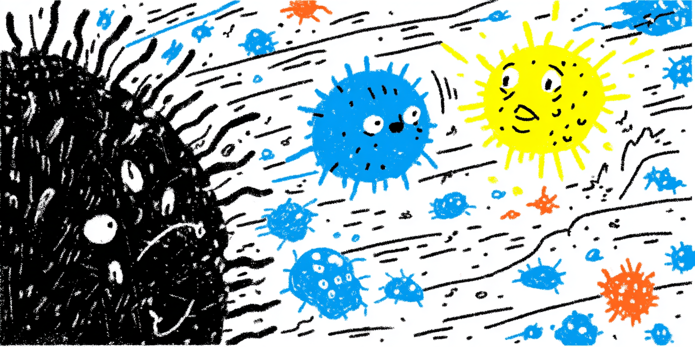

  

<h1 align="center">Bloom Experiments</h1>

  <em>Hello there, I'm Thomas.</em>

---

This repository contains the code snippets of my experiments on comfybloom ([comfyspace.tech/bloom](https://comfyspace.tech/bloom)).

  

These are experiments towards the full loop of curing cancer through the use of personalized neo-antigens.

While this doesn't entirely cover everything available and required in a typical Bloom experiments (lots of things are done in the UI of many websites), I believe a sufficiently good AI Coding Agent (Antigravity, Codex, Claude, Cursor, etc.) can help you figure that out.

---

> 📬 If you have any question, reach out to me at [thomas@comfyspace.tech](mailto:thomas@comfyspace.tech)
