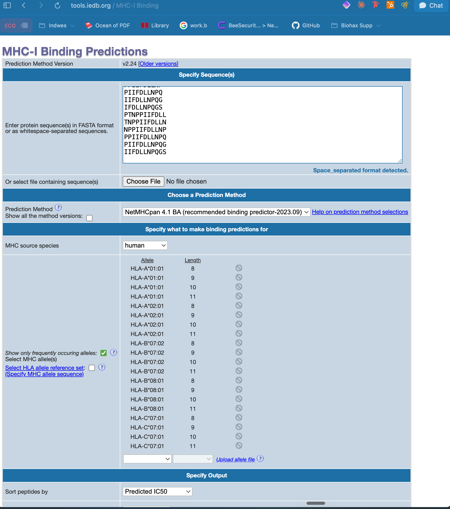
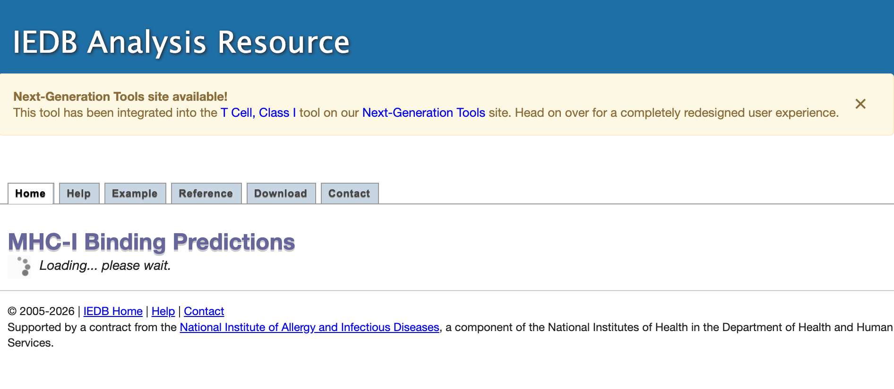
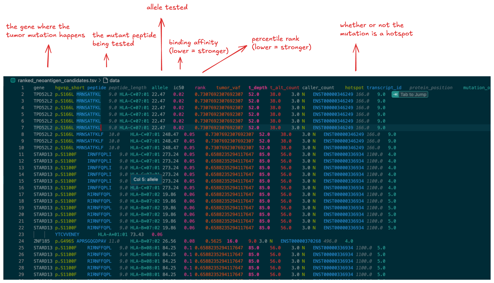
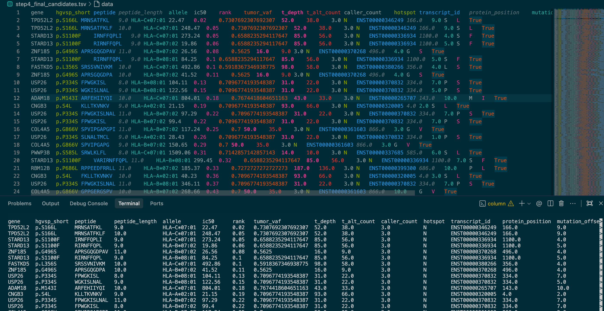

The goal of Challenge 8 is:

Given real tumor missense mutations, generate short mutant peptides, predict which ones bind strongly to HLA molecules, and rank them as candidate neoantigens.

There are 4 steps:

1. Start from missense mutations in the tumor MAF.
   Use the normal/reference protein sequence as a template, apply each tumor mutation, and generate 8, 9, 10, and 11-mer mutant peptides.

[Tumor MAF](5b913527-2907-4006-b096-c460e6054c10.wxs.aliquot_ensemble_masked.maf)
[HLA Panel](hla_panel.txt)

2. Run NetMHCpan.
   Test each mutant peptide against multiple HLA alleles to predict peptide-HLA binding strength.

[NetMHCpan Results](netmhcpan_results.txt)

3. Rank candidate neoantigens.
   Prioritize low IC50, low percentile rank, high tumor VAF, and good read support.

4. Safety/filtering.
   Remove candidates that look like normal human/self peptides, such as peptides that match the healthy human proteome or whose wildtype version also binds strongly.

